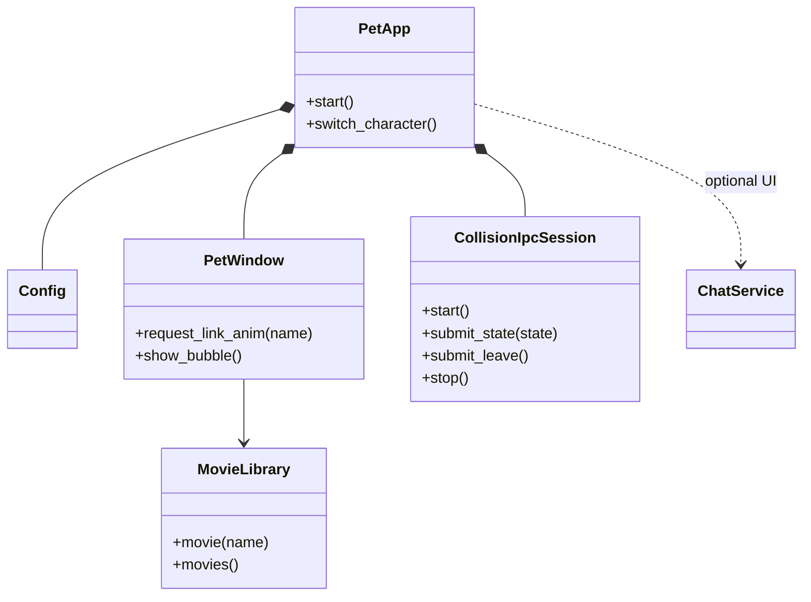
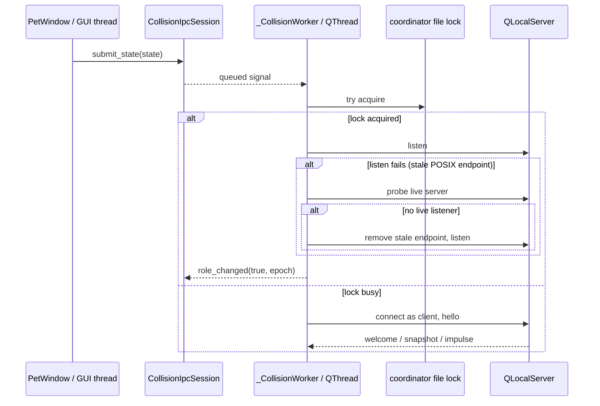

# Engineering guide

## Project shape

This is a PySide6 desktop-pet application. `python -m pet` enters through
`pet/__main__.py`; `PetApp` owns application-level services, `PetWindow` owns
interactive pet behavior, and `MovieLibrary` owns animation media. Keep Qt
objects on their owning thread and communicate across threads with queued
signals.

The IPC facade belongs to the GUI thread; `_CollisionWorker` and every
`QLocalServer`, `QLocalSocket`, and IPC timer belong to its dedicated `QThread`.
The shared kernel file lock is the coordinator authority. On POSIX, a lock
holder that fails to `listen()` because of a stale Unix socket first probes
for a live listener, and only removes the stale endpoint when nobody answers.

## Change discipline

- Preserve user changes in a dirty worktree and keep generated build output out
  of commits.
- Fix behavior test-first at a public seam. For Qt/IPC regressions, use real
  event loops and process boundaries; mock only operating-system or network
  boundaries that cannot run deterministically.
- A fix is complete when the focused regression is red before the product
  change, green afterward, and verification matches the risk gate below.
- Run the full suite for shared models/config migrations, application lifecycle,
  threading/IPC, packaging/dependencies, platform branches, changes spanning
  multiple test domains, or the final accumulated branch before merge.
- Focused plus related tests are sufficient for a local presentation token or
  isolated widget behavior when interfaces, persisted data, lifecycle, and
  platform dispatch are unchanged. Record why the full suite was skipped.
- Keep `CollisionIpcSession.stop()` ordering intact: stop producers, send leave,
  close local endpoints and timers, then quit/wait for the worker thread.
- Keep QLocal test server names short. POSIX converts names to Unix socket paths,
  whose limit includes the system temporary-directory prefix.

## CI cost discipline (learned 2026-09-06, PR76 CI loop)

CI 反复红的代价极高（每轮 5-10 分钟 + 诊断烧调用额度）。硬性规矩：

- **推送前必过三道本地门**：ruff、全量 pytest、受影响时序测试族的高负载
  复跑（本地 CPU 打满跑 3 遍）。缝合/脚本化改动后必须重跑 ruff——
  重复定义/残留 import 这类一眼问题不许交给 CI 去发现。
- **写时序测试 = CI 优先纪律**：新测试涉及真实线程/Qt 事件循环时，一律
  事件同步（Event/Condition）+ 宽预算（CI 慢 runner 是本地数倍慢），
  禁止固定 sleep 猜测时序、禁止赌目录枚举顺序、禁止用 monotonic 绝对值
  做回拨算术（CI runner 是新开机的，uptime 可能只有几百秒）。
- **CI 红先读日志再动手**：连续两轮修同一族测试不绿，停止重试，把族
  隔离出主套件（对齐 webm 生命周期族先例），别在 PR 门禁里赌时序。
- 诊断类排查能本地复现就不派付费子代理；派子代理必须给齐已知排除项，
  避免重复劳动烧额度。

Run focused tests before `python -m pytest -q`. Set
`QT_QPA_PLATFORM=offscreen` in headless environments. A restricted macOS
sandbox may deny Unix socket creation; rerun QLocalServer tests with local IPC
permission rather than treating errno 1 as a product failure.

## Agent skills

### Issue tracker

Issues and specs use Local Markdown under `.scratch/<feature-slug>/`. See
`docs/agents/issue-tracker.md`.

### Triage labels

Use the five canonical local triage states. See
`docs/agents/triage-labels.md`.

### Domain docs

Use the single-context layout: root `CONTEXT.md` and system ADRs under
`docs/adr/`. See `docs/agents/domain.md`.

### Qt UI review

Use `.agents/skills/qt-ui-review/SKILL.md` when reviewing settings, menus,
overlays, QSS, accessibility, or cross-platform desktop presentation.

### Qt UI development

Use `.agents/skills/desktop-pet-ui-style/SKILL.md` when adding or materially
restyling settings, menus, dialogs, overlays, or desktop widgets.

### Work handoff

For unfinished multi-ticket work, read and refresh the feature's
`.scratch/<feature-slug>/HANDOFF.md` before ending or resuming work. Keep the
exact breakpoint there; see `docs/agents/handoff.md`.

## Context pointers

- Read `docs/ISSUE-42-POSIX-COLLISION-IPC-2026-08-31.md` when changing collision
  election, QLocal IPC, coordinator locking, or their process-level tests.
- Read `docs/ISSUE-111-WINDOWS-SESSION-END-FFMPEG-2026-09-12.md` when changing
  ffmpeg spawning (`webm_clip` reader/first-frame/meta/exe probes), warm
  scheduling, or anything that runs during Windows shutdown/logoff
  (`session_watcher`, `match_shutdown`, `AppShell._on_session_end`).
- Read `docs/ONEDIR_PACKAGING.md` when changing PyInstaller specs, bundled
  resources, or platform build scripts.
- Read `docs/STABLE_BUILDS.md` when changing release/build workflows.
- Read `docs/CONTEXT-MENU-RESEARCH-AND-REFACTOR-2026-08-25.md` when changing
  context-menu structure, styling, interaction, or platform behavior.
- Read `docs/SETTINGS-CHANGE-GATES.md` before adding, moving, removing, or
  changing a persistent setting or its settings-page interaction.
- Read `docs/PERSONA-PHRASES-PRESET-STORAGE-2026-09-08.md` before changing
  dialogue preset files (`pet/persona_presets/*.json`), phrase loading
  (`persona_phrases.py`), or expression-style semantics
  (`dialogue_mode`/`dialogue_phrases`).
- Read `docs/PR-MERGE-LESSONS-2026-09-12.md` before merging PRs: stacked-PR
  conflicts after squashing the parent, budget/red-line changes that only break
  when two PRs combine, and timing-test flake discipline (poll state with a wide
  budget instead of fixed sleeps).
- Treat `assets/characters/<id>/videos/` plus its manifest as one character
  package; preserve relative paths and case because packaged platforms differ.
  The manifest may declare `body_box` (`[x1, y1, x2, y2]` in source pixels,
  mirror-symmetrized): the stable body rect used as the placement/edge-clamp
  anchor (`pet/catalog.py character_body_box`); measure it at alpha≥128 to
  match the mask/visual edge, and omit it to fall back to full-canvas behavior.
